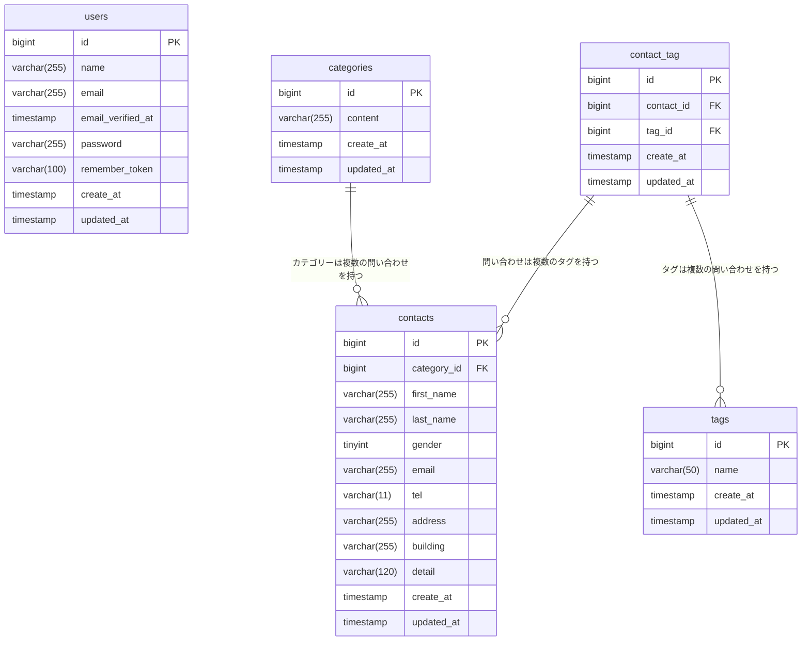

# COACHTECH お問い合わせフォーム

## 概要
- 本システムは、一般ユーザーが利用する公開のお問い合わせフォームです。
- 誰でもお問い合わせを送信でき、管理者はログイン後にその内容を確認・管理します。
- 公開APIで認証不要でお問い合わせのCRUD操作が可能。

## ER図



## 環境構築手順
⚠️  日本語化／翻訳について:
— 日本語化は FormRequest の `messages()` と `lang/ja`（認証系）で行います。
`laravel-lang/*` 系の外部翻訳パッケージ（`composer require laravel-lang/...`）は導入しないでください。同系パッケージは 2026年5月のサプライチェーン攻撃でマルウェア配布に悪用された経緯があり、本課題では不要です。<br>

<div style="line-height: 1.2; margin-bottom: 10px;">
<details>
<summary>1. Laravelプロジェクトの作成 (Laravel 10.x):手順詳細</summary>
<div style="border: 1px solid #ccc; padding: 10px;">
注意: curl -s "https://laravel.build/..." は最新版のLaravelをインストールするため、今回は使用しません。<br>
以下のDockerコマンドを実行して、Laravel 10.xを明示的に指定してプロジェクトを作成します。<br>

#### 提供リポジトリの本ディレクトリをクローン
以下のリポジトリをクローンし、resourcesディレクトリを丸ごと入れ替えます。
```
git clone https://github.com/Ma-Namba/contact-form-app
```
</div>
</details>
</div>

<div style="line-height: 1.2; margin-bottom: 10px;">
<details>
<summary>2. Laravel Sailのインストール : 手順詳細</summary>
<div style="border: 1px solid #ccc; padding: 10px;">
"プロジェクト作成後、contact-form-app ディレクトリに移動し、Laravel Sailをインストールします。

#### プロジェクトディレクトリに移動
```
cd contact-form-app
```

#### Laravel Sailをインストール
```
docker run --rm \
    -u ""$(id -u):$(id -g)"" \
    -v ""$(pwd):/var/www/html"" \
    -w /var/www/html \
    -e COMPOSER_CACHE_DIR=/tmp/composer_cache \
    laravelsail/php82-composer:latest \
    composer require laravel/sail --dev
```

#### Sailの設定ファイルをパブリッシュ（MySQLを選択）
```
docker run --rm \
    -u ""$(id -u):$(id -g)"" \
    -v ""$(pwd):/var/www/html"" \
    -w /var/www/html \
    -e COMPOSER_CACHE_DIR=/tmp/composer_cache \
    laravelsail/php82-composer:latest \
    php artisan sail:install --with=mysql
```

#### ※M1/M2/M3 Mac（Apple Silicon）をお使いの方
Apple Silicon搭載のMacでは、`sail up -d`実行時に以下のエラーが発生することがあります：
```
no matching manifest for linux/arm64/v8
```

解決方法: `compose.yaml`を開き、mysqlサービスに`platform: 'linux/amd64'`を追加してください。
```
mysql:
    image: 'mysql/mysql-server:8.0'
    platform: 'linux/amd64'  # ← この行を追加
    ports:"
```

</div>
</details>
</div>

<div style="line-height: 1.2; margin-bottom: 10px;">
<details>
<summary>3. .env ファイルの設定 : 手順詳細</summary>
<div style="border: 1px solid #ccc; padding: 10px;">
.env ファイルを開き、データベース接続情報が以下と一致していることを確認します。
```
DB_CONNECTION=mysql
DB_HOST=mysql
DB_PORT=3306
DB_DATABASE=laravel
DB_USERNAME=sail
DB_PASSWORD=password
```

重要: DB_HOST は localhost や 127.0.0.1 ではなく、Dockerコンテナ名である mysql を指定します。
</div>
</details>
</div>


<div style="line-height: 1.2; margin-bottom: 10px;">
<details>
<summary>4. フロントエンドのセットアップ (Vite & Tailwind CSS) : 手順詳細</summary>
<div style="border: 1px solid #ccc; padding: 10px;">
本プロジェクトでは、フロントエンドのスタイリングにTailwind CSSを使用します。

NPM依存パッケージのインストール
重要: sail npm install を実行する前に、必ずSailコンテナが起動していることを確認してください。
```
sail npm install
```

Tailwind CSSのインストール
```
sail npm install -D tailwindcss@^3.4.0 postcss autoprefixer
sail npm install alpinejs
```

設定ファイルの生成
```
sail npx tailwindcss init -p
```

Tailwind CSSのテンプレートパス設定
tailwind.config.js を開き、以下のように設定します。
```
/** @type {import(""tailwindcss"").Config} */
export default {
  content: [
    ""./resources/**/*.blade.php"",
    ""./resources/**/*.js"",
    ""./resources/**/*.vue"",
  ],
  theme: {
    extend: {},
  },
  plugins: [],
}
```

Vite開発サーバーの起動
```
sail npm run dev
```

注意: sail npm run dev は実行したままにしておく必要があります。
</div>
</details>
</div>


<div style="line-height: 1.2; margin-bottom: 10px;">
<details>
<summary>5. phpMyAdminの追加 : 手順詳細</summary>
<div style="border: 1px solid #ccc; padding: 10px;">
compose.yaml を開き、mysql サービスの後に以下の設定の追加をしてください。

compose.yaml に追加する内容:
```
    phpmyadmin:
        image: 'phpmyadmin:latest'
        ports:
            - '${FORWARD_PHPMYADMIN_PORT:-8080}:80'
        environment:
            PMA_HOST: mysql
            PMA_USER: '${DB_USERNAME}'
            PMA_PASSWORD: '${DB_PASSWORD}'
        networks:
            - sail
        depends_on:
            - mysql
```

</div>
</details>
</div>

<div style="line-height: 1.2; margin-bottom: 10px;">
<details>
<summary>6. Sailの起動とエイリアス設定 : 手順詳細</summary>
<div style="border: 1px solid #ccc; padding: 10px;">
# Sailをバックグラウンドで起動
```
./vendor/bin/sail up -d
```

#### エイリアスを設定して 'sail' だけでコマンドを実行できるようにする
```
echo ""alias sail='[ -f sail ] && bash sail || bash vendor/bin/sail'"" >> ~/.zshrc
```

#### または bash の場合
```
# echo ""alias sail='[ -f sail ] && bash sail || bash vendor/bin/sail'"" >> ~/.bashrc
```

#### シェルを再起動するか、新しいターミナルを開いてエイリアスを有効にする
```
exec $SHELL
```

</div>
</details>
</div>

<div style="line-height: 1.2; margin-bottom: 10px;">
<details>
<summary>7. アプリケーションキーの生成 : 手順詳細</summary>
<div style="border: 1px solid #ccc; padding: 10px;">
ルートで以下のコマンドを実行する
```
sail artisan key:generate
```

</div>
</details>
</div>

<div style="line-height: 1.2; margin-bottom: 10px;">
<details>
<summary>8. データベースのマイグレーションと初期データ投入 : 手順詳細</summary>
<div style="border: 1px solid #ccc; padding: 10px;">
以下のコマンドでテーブルを作成し、初期データを投入します。
```
sail artisan migrate --seed
```

※既存のデータベースをリセットしたい場合は以下を実行してください。
```
sail artisan migrate:fresh --seed
```
</div>
</details>
</div>

## 使用技術
- OS（Dockerが動作する任意のOS）: -
- PHP : 8.2
- Laravel : 10.x
    - Laravel Sail
    - Laravel Fortify
- DB : MySQL 8.0
- Webサーバー : Nginx
- フロントエンド : Vite, Tailwind CSS ^3.4.0
- 開発ツール : Docker, Laravel Sail, phpMyAdmin

## APIエンドポイント一覧
| HTTPメソッド | URI | 説明 |
| --- | --- | --- |
| GET | /api/v1/contacts | お問い合わせ一覧（検索・ページネーション付き） |
| GET | /api/v1/contacts/{contact} | お問い合わせ詳細（カテゴリ・タグ含む） |
| POST | /api/v1/contacts | お問い合わせ新規作成 |
| PUT | /api/v1/contacts/{contact} | お問い合わせ更新 |
| DELETE | /api/v1/contacts/{contact} | お問い合わせ削除 |

## 開発環境URL
- ローカル : http://localhost
- リモート : https://github.com/Ma-Namba/contact-form-app

## 作成者
Mamiko Namba
